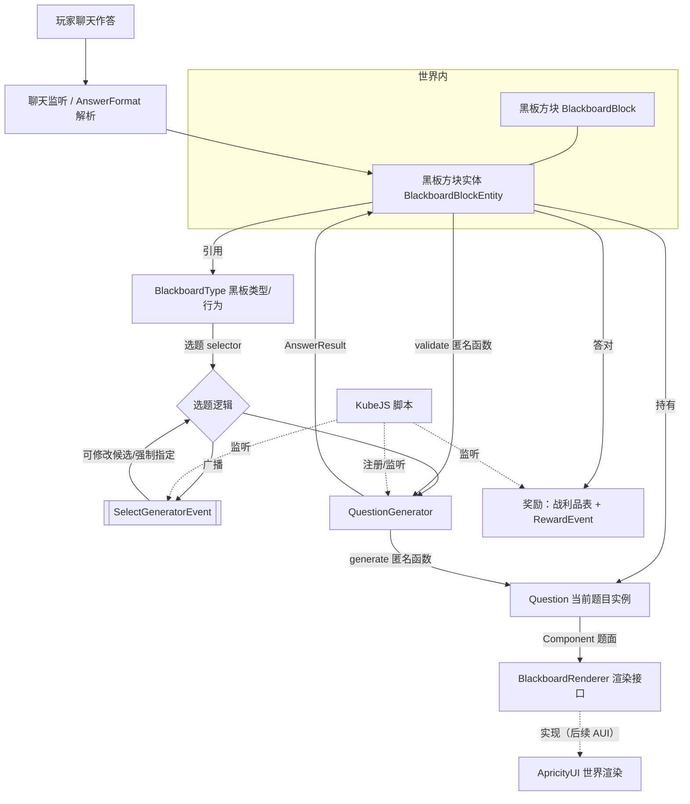
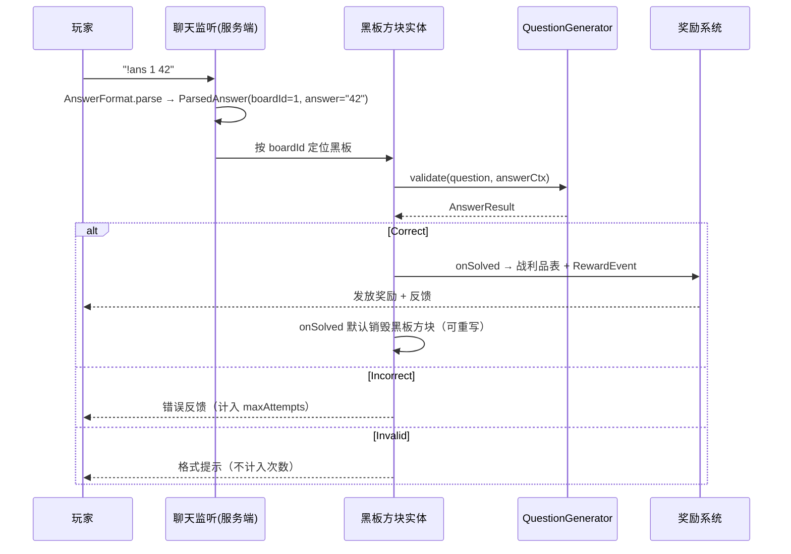

# Blackboard 模组设计文档

> 一个提供「黑板方块」的 Minecraft 模组：黑板使用 **ApricityUI（晴雪UI / AUI）** 在世界中渲染一道题目，玩家在聊天栏以特定格式作答，答对后获得奖励。
> 核心目标是**高度可扩展**：其他模组可以注册行为不同的新黑板、注册自定义题目生成器，并通过事件干预题目选择逻辑；同时提供 **KubeJS** 兼容，使整合包作者无需写 Java/Kotlin 即可扩展。

---

## 1. 概述

| 项目 | 值 |
| --- | --- |
| Mod ID | `blackboard` |
| 根包名 | `com.tonywww.blackboard` |
| 开发语言 | Kotlin |
| 跨版本工具 | [Stonecutter](https://stonecutter.kikugie.dev/) |
| 目标版本 | 1.20.1（Forge）、1.21.1（NeoForge） |
| 渲染依赖 | [ApricityUI / 晴雪UI](https://doc.sighs.cc/ApricityUI)（`com.sighs:ApricityUI`，通过 `BlackboardRenderer` 接口接入，**本阶段不实现**） |
| 可选软依赖 | KubeJS（用于脚本化注册题目生成器） |

> 说明：`1.20.1 Forge` 与 `1.21.1 NeoForge` 是两个不同的加载器，但 API 高度相似。我们使用 Stonecutter 在**单一源码集**中通过版本条件块切换加载器/版本差异，并产出两个发行 jar。

---

## 2. 设计目标

1. **简单可玩**：放置黑板 → 自动出题 → 聊天作答 → 答对给奖励。
2. **可扩展的黑板**：黑板的行为（出哪种题、如何选题、如何发奖）由 `BlackboardType` 描述，其他模组可注册新的 `BlackboardType`。
3. **可扩展的题目**：通过**函数式**的 `QuestionGenerator` 注册题目生成器，「出题」与「判题」均为匿名函数。
4. **可干预的选题**：每次出题时广播事件，开发者可在事件中修改候选生成器列表或强制指定生成器。
5. **广泛的题型**：支持一切「可用文本作答」的题目——文字题、计算题、微积分、矩阵等。
6. **KubeJS 兼容**：开发者可用 KubeJS 注册题目生成器、监听选题与奖励事件。
7. **跨版本一致**：对外 API 在 1.20.1 / 1.21.1 表现一致，版本差异内聚在适配层。

---

## 3. 架构总览



核心对象：

- **`BlackboardBlock` / `BlackboardBlockEntity`**：世界中的方块与其状态（当前题目、所属 `BlackboardType`、作答记录）。
- **`Question`**：一道**已生成**的题目实例，题面为一个 `Component`（数学题可含 LaTeX），可序列化随方块实体持久化。
- **`QuestionGenerator`**：题目生成器，包含 `generate`（出题）与 `validate`（判题）两个匿名函数。
- **`BlackboardType`**：黑板的**行为**定义（选题策略、奖励策略、作答格式等），是其他模组扩展的主要入口。
- **`BlackboardRegistries`**：加载器无关的注册表，KubeJS 与原生代码共用。
- **`BlackboardEvents`**：自定义事件总线，跨加载器表现一致；所有事件携带黑板的 `level`、`pos`、`blockState`。
- **`BlackboardRenderer`**：渲染**接口**；本模组只定义接口并传入题面 `Component`，由 ApricityUI 实现（后续接入）。

---

## 4. 项目结构（Stonecutter）

```
Blackboard/
├─ settings.gradle.kts          # 声明 stonecutter 版本节点 (1.20.1-forge, 1.21.1-neoforge)
├─ stonecutter.gradle.kts
├─ build.gradle.kts             # 公共构建逻辑 + 按版本切换加载器依赖
├─ docs/
│  └─ blackboard-design.md      # 本文档
└─ src/
   └─ main/
      ├─ kotlin/com/tonywww/blackboard/
      │  ├─ Blackboard.kt                 # 入口 / 公共初始化
      │  ├─ api/                          # 对外稳定 API（其他模组依赖此处）
      │  │  ├─ question/                  #   Question / QuestionGenerator / 上下文
      │  │  ├─ board/                     #   BlackboardType / 选题与奖励上下文
      │  │  ├─ event/                     #   BlackboardEvents 及各事件类
      │  │  └─ registry/                  #   BlackboardRegistries / SimpleRegistry
      │  ├─ content/                      # 方块、方块实体、物品、注册
      │  ├─ render/                       # 渲染接口 BlackboardRenderer（AUI 实现后续接入）
      │  ├─ chat/                         # 聊天监听与 AnswerFormat
      │  ├─ builtin/                      # 内置题目生成器（加减乘除、文字题…）
      │  ├─ compat/kubejs/                # KubeJS 绑定（软依赖，反射/可选编译）
      │  └─ platform/                     # 加载器适配层（事件总线/注册差异）
      └─ resources/
         ├─ apricity/blackboard/          # AUI 静态资源（HTML/CSS/字体）
         └─ data/blackboard/loot_tables/  # 默认奖励战利品表
```

> 在 Stonecutter 中，加载器/版本差异（如 Forge 的 `RegistryObject` 与 NeoForge 的 `DeferredHolder`、事件总线注册方式）用 `//? if forge {` / `//? if neoforge {` 条件注释隔离，主要集中在 `platform/` 与 `content/` 内，**对外 API 不出现版本差异**。

---

## 5. 核心 API 设计

> 以下接口位于 `com.tonywww.blackboard.api`，是其他模组依赖的稳定层。所有「可自定义方法」均以**匿名函数（lambda）**形式提供，符合函数式编程要求。

### 5.1 题目实例 `Question`

```kotlin
package com.tonywww.blackboard.api.question

/** 一道已生成的题目实例，可序列化随方块实体持久化。 */
interface Question {
    /** 生成它的题目生成器 ID。 */
    val generatorId: ResourceLocation

    /** 题面内容：一个 Component（数学题可含 LaTeX），将直接交给渲染接口 / AUI 渲染。 */
    val content: Component

    /** 生成器自定义的持久化数据（标准答案、随机种子、参数等）。 */
    val data: CompoundTag

    /** 可选：用于聊天/日志的纯文本题面。 */
    val prompt: Component?

    // 便捷读取（由实现提供）
    fun getInt(key: String): Int
    fun getDouble(key: String): Double
    fun getString(key: String): String
}
```

### 5.2 渲染接口 `BlackboardRenderer`

> 本模组**只定义渲染接口并传入题面 `Component`**，不在此处实现具体渲染。后续由 ApricityUI 接入：把 `Component`（可含 LaTeX）交给 AUI 的 HTML 渲染世界内黑板。

```kotlin
/** 渲染接口。具体实现（ApricityUI）后续提供。 */
fun interface BlackboardRenderer {
    fun render(context: RenderContext)
}

interface RenderContext {
    val level: Level
    val pos: BlockPos
    val blockState: BlockState
    /** 题面内容（可含 LaTeX），直接交给 AUI 渲染。 */
    val content: Component
}

/** 全局渲染器持有处；默认 No-op 占位，AUI 集成后注入实现。 */
object BlackboardRendering {
    var renderer: BlackboardRenderer = BlackboardRenderer { /* no-op 占位 */ }
}
```

> 数学题统一使用 **LaTeX** 写在 `Component` 中（例如 `\frac{d}{dx}x^2`），渲染交给 AUI 的 HTML，本模组不处理排版。

### 5.3 生成与判题上下文

```kotlin
/** 出题上下文。 */
interface GenerationContext {
    val level: ServerLevel
    val pos: BlockPos
    val blockState: BlockState
    val blackboard: BlackboardType
    val random: RandomSource
    /** 触发出题的玩家（如有）。 */
    val player: ServerPlayer?
    /** 难度参数，可由黑板类型或方块状态提供（默认 0）。 */
    val difficulty: Int
}

/** 作答上下文。 */
interface AnswerContext {
    val player: ServerPlayer
    val level: ServerLevel
    val pos: BlockPos
    val blockState: BlockState
    /** 玩家提交的原始答案文本（已去掉格式前缀与黑板标识）。 */
    val text: String
}

/** 判题结果。 */
sealed interface AnswerResult {
    /** 正确。score 用于部分得分题（0..1）。 */
    data class Correct(val score: Double = 1.0, val feedback: Component? = null) : AnswerResult
    /** 错误（消耗一次作答机会）。 */
    data class Incorrect(val feedback: Component? = null) : AnswerResult
    /** 无法判定（格式不符等），不消耗作答机会。 */
    data class Invalid(val feedback: Component? = null) : AnswerResult

    companion object {
        fun correct(score: Double = 1.0) = Correct(score)
        fun incorrect() = Incorrect()
        fun invalid() = Invalid()
    }
}
```

### 5.4 题目生成器 `QuestionGenerator`（函数式核心）

```kotlin
class QuestionGenerator private constructor(
    val id: ResourceLocation,
    /** 出题：匿名函数。 */
    val generate: (GenerationContext) -> Question,
    /** 判题：匿名函数。 */
    val validate: (Question, AnswerContext) -> AnswerResult,
    /** 默认权重（用于加权随机选题）。 */
    val weight: Int,
    /** 标签，便于按池/分类筛选（如 #blackboard:math）。 */
    val tags: Set<ResourceLocation>,
) {
    class Builder(private val id: ResourceLocation) {
        private var generate: ((GenerationContext) -> Question)? = null
        private var validate: ((Question, AnswerContext) -> AnswerResult)? = null
        private var weight = 1
        private val tags = mutableSetOf<ResourceLocation>()

        fun generate(fn: (GenerationContext) -> Question) = apply { generate = fn }
        fun validate(fn: (Question, AnswerContext) -> AnswerResult) = apply { validate = fn }
        fun weight(w: Int) = apply { weight = w }
        fun tag(vararg t: ResourceLocation) = apply { tags += t }

        fun build(): QuestionGenerator =
            QuestionGenerator(
                id,
                requireNotNull(generate) { "generate(...) 未设置: $id" },
                requireNotNull(validate) { "validate(...) 未设置: $id" },
                weight, tags,
            )
    }

    companion object {
        fun builder(id: ResourceLocation) = Builder(id)
    }
}
```

**注册示例（一个加法题生成器）：**

```kotlin
BlackboardRegistries.QUESTION_GENERATORS.register(
    QuestionGenerator.builder(id("addition"))
        .tag(BlackboardTags.MATH)
        .weight(10)
        .generate { ctx ->
            val a = ctx.random.nextInt(1, 100)
            val b = ctx.random.nextInt(1, 100)
            Question.builder(id("addition"))
                .content(Component.literal("$a + $b = ?"))   // 题面 Component（数学题可写 LaTeX）
                .store("answer", a + b)
                .prompt(Component.literal("$a + $b = ?"))
                .build()
        }
        .validate { question, answer ->
            val expected = question.getInt("answer")
            if (answer.text.trim().toIntOrNull() == expected)
                AnswerResult.correct()
            else
                AnswerResult.incorrect()
        }
        .build()
)
```

### 5.5 黑板类型 `BlackboardType`（其他模组扩展入口）

`BlackboardType` 描述「这块黑板**怎么行为**」，其他模组通过注册新的 `BlackboardType` 来创建行为不同的黑板（不同选题池、不同奖励、不同作答格式等）。

```kotlin
class BlackboardType private constructor(
    val id: ResourceLocation,

    /** 候选生成器来源（按标签或显式集合）。 */
    val pool: GeneratorPool,

    /** 选题策略：从候选中选一个。默认按权重随机。事件可覆盖（见 §6）。 */
    val selector: (SelectionContext) -> QuestionGenerator,

    /** 答对回调：默认发放 rewardLootTable，再广播 RewardEvent。 */
    val onSolved: (RewardContext) -> Unit,

    /** 答错回调：默认无。 */
    val onFailed: (AnswerContext) -> Unit,

    /** 默认奖励战利品表。 */
    val rewardLootTable: ResourceLocation?,

    /** 作答格式解析器；默认要求指定黑板（见 §7）。 */
    val answerFormat: AnswerFormat,

    /** 每题最大作答次数；<=0 表示不限。 */
    val maxAttempts: Int,
) {
    class Builder(private val id: ResourceLocation) { /* 同 §5.4 风格的链式 Builder */ }
    companion object { fun builder(id: ResourceLocation) = Builder(id) }
}
```

`GeneratorPool` 抽象候选来源：

```kotlin
sealed interface GeneratorPool {
    /** 取某标签下全部生成器。 */
    data class ByTag(val tag: ResourceLocation) : GeneratorPool
    /** 显式集合。 */
    data class Explicit(val ids: List<ResourceLocation>) : GeneratorPool
    /** 全部已注册生成器。 */
    data object All : GeneratorPool
}
```

> 默认黑板 `blackboard:default`：`pool = ByTag(#blackboard:default)`，`selector = 加权随机`，`onSolved = 发放 blackboard:rewards/default 战利品表`，`answerFormat = 指定黑板格式`。
>
> **答对后默认销毁黑板方块**：每块黑板**固定一题、全员共享同一题面**，首位答对者解出后方块消失。该「答对后销毁」是 `BlackboardBlockEntity` 的**可重写默认方法**（`open fun onSolved`），其他模组的黑板方块可重写以改变行为（保留方块、重新出题等）。

### 5.6 注册表 `BlackboardRegistries`

为兼顾**加载器无关**与 **KubeJS 启动期注册**，注册表采用模组自管理的简单注册表（而非原版/Forge 注册表），键为 `ResourceLocation`：

```kotlin
object BlackboardRegistries {
    val QUESTION_GENERATORS = SimpleRegistry<QuestionGenerator>("question_generator")
    val BLACKBOARD_TYPES   = SimpleRegistry<BlackboardType>("blackboard_type")
}

class SimpleRegistry<T>(val name: String) {
    fun register(id: ResourceLocation, value: T): T
    fun register(value: T): T            // 当 T 自带 id 时
    fun get(id: ResourceLocation): T?
    fun all(): Collection<T>
    fun byTag(tag: ResourceLocation): List<T>   // 仅对带 tag 的类型有效
}
```

> 注册时机：原生代码在模组初始化阶段注册；KubeJS 在其 `startup` 脚本阶段注册（见 §8）。注册表在世界加载前冻结一致快照，方块实体仅持久化 `generatorId` + `Question.data`，避免存档绑定到具体 lambda。

---

## 6. 事件系统

为在 Forge 与 NeoForge 上**行为一致**，自定义一套轻量事件总线（类似 Fabric 的 `Event<T>`）。底层在各加载器仅用于「在合适时机触发」，对外 API 不变。

> **所有事件都携带黑板方块的 `level`、`pos`、`blockState`**，便于开发者编写自定义逻辑；奖励事件额外携带 `player`。

```kotlin
object BlackboardEvents {
    /** 出题前广播：可修改候选/权重，或强制指定生成器。 */
    val SELECT_GENERATOR = EventHook<SelectGeneratorEvent>()
    /** 题目生成后广播：可读取/二次处理（如统计、日志、改写渲染）。 */
    val QUESTION_GENERATED = EventHook<QuestionGeneratedEvent>()
    /** 作答判定后广播。 */
    val ANSWER = EventHook<AnswerEvent>()
    /** 答对发奖前广播：可增删奖励物品或替换战利品表。 */
    val REWARD = EventHook<RewardEvent>()
}

class EventHook<T> {
    fun register(listener: (T) -> Unit)
    fun invoke(event: T)
}
```

### 6.1 选题事件 `SelectGeneratorEvent`（需求重点）

> 「在黑板生成题目时，广播一个事件，允许开发者修改题目生成器的选择逻辑。」

```kotlin
class SelectGeneratorEvent(
    val context: SelectionContext,
    /** 当前候选（含权重）。监听器可增、删、改权重。 */
    val candidates: MutableList<WeightedGenerator>,
) {
    /** 设置后跳过加权随机，直接使用该生成器。 */
    var forced: QuestionGenerator? = null
}

data class WeightedGenerator(val generator: QuestionGenerator, var weight: Int)

interface SelectionContext {
    val blackboard: BlackboardType
    val level: ServerLevel
    val pos: BlockPos
    val blockState: BlockState
    val player: ServerPlayer?
}
```

选题主流程：

```kotlin
fun selectGenerator(type: BlackboardType, ctx: SelectionContext): QuestionGenerator {
    val candidates = type.pool.resolve()
        .map { WeightedGenerator(it, it.weight) }
        .toMutableList()

    val event = SelectGeneratorEvent(ctx, candidates)
    BlackboardEvents.SELECT_GENERATOR.invoke(event)        // ← 广播，开发者可干预

    event.forced?.let { return it }
    return type.selector(SelectionContext.withCandidates(ctx, event.candidates))
}
```

### 6.2 奖励事件 `RewardEvent`

```kotlin
class RewardEvent(
    val level: ServerLevel,
    val pos: BlockPos,
    val blockState: BlockState,
    val player: ServerPlayer,
    val question: Question,
    val result: AnswerResult.Correct,
    /** 默认战利品表（可被替换为 null 取消默认发放）。 */
    var lootTable: ResourceLocation?,
    /** 额外掉落/给予的物品（开发者自定义奖励逻辑）。 */
    val extraDrops: MutableList<ItemStack>,
)
```

> 奖励 = **战利品表 + 事件**：默认按 `BlackboardType.rewardLootTable` 生成奖励，开发者可在 `REWARD` 事件中替换战利品表或追加 `extraDrops`，实现完全自定义的奖励逻辑。

### 6.3 其他事件

```kotlin
/** 题目生成后广播。 */
class QuestionGeneratedEvent(
    val level: ServerLevel,
    val pos: BlockPos,
    val blockState: BlockState,
    val question: Question,
    val player: ServerPlayer?,
)

/** 作答判定后广播。 */
class AnswerEvent(
    val level: ServerLevel,
    val pos: BlockPos,
    val blockState: BlockState,
    val player: ServerPlayer,
    val question: Question,
    val result: AnswerResult,
)
```

---

## 7. 答题流程

### 7.1 作答格式 `AnswerFormat`

按你的要求，**当前默认采用「指定黑板」格式**（玩家需指明回答哪块黑板），且格式可插拔以便日后修改：

```kotlin
fun interface AnswerFormat {
    /** 解析一条聊天消息；返回 null 表示这不是作答消息。 */
    fun parse(message: String): ParsedAnswer?
}

data class ParsedAnswer(
    /** 黑板标识（短 ID / 名称）。 */
    val boardId: String,
    /** 去除前缀与黑板标识后的答案正文。 */
    val answer: String,
)
```

默认实现（**待确认细节，见 §13**）：

```
!ans <黑板标识> <答案>
例：  !ans 1 42
      !ans north [[1,2],[3,4]]
```

- `<黑板标识>`：每块放置的黑板拥有一个可寻址标识（自动分配的短 ID，或用命名牌/铁砧重命名）。
- 解析在**服务端**聊天事件中进行；匹配到作答消息时拦截/标记，避免广播给全频道（是否拦截见 §13）。

### 7.2 完整流程



---

## 8. 渲染集成（接口先行，AUI 后续实现）

> 本阶段**只定义渲染接口**，不实现具体渲染。题面是一个 `Component`，后续由 ApricityUI 实现 `BlackboardRenderer`，把 `Component`（可含 LaTeX）交给 AUI 的 HTML 在世界中渲染。

```kotlin
// 题目更新时：由当前渲染器渲染（默认 No-op，AUI 集成后注入实现）
BlackboardRendering.renderer.render(object : RenderContext {
    override val level = this@BlackboardBlockEntity.level!!
    override val pos = this@BlackboardBlockEntity.blockPos
    override val blockState = this@BlackboardBlockEntity.blockState
    override val content = question.content   // Component，可含 LaTeX
})
```

要点：

- **解耦**：核心逻辑只依赖 `BlackboardRenderer` 接口与题面 `Component`，不直接依赖 AUI；缺少 AUI 时使用 No-op 渲染器，功能（出题/作答/奖励）仍可用。
- **服务端→客户端同步**：题目在服务端生成，题面 `Component` 与 `generatorId` 随方块实体同步到客户端，由客户端渲染器渲染。
- **后续 AUI 接入**：实现一个把 `Component`（含 LaTeX）转为 AUI HTML 并调用其世界内渲染（如 `WorldWindow`）的 `BlackboardRenderer`，注入 `BlackboardRendering.renderer` 即可，无需改动核心逻辑。

---

## 9. 题型支持

所有题型都「用文本作答」，差异只在于**题面内容**（写进 `Component`）与**判题**（`validate` 如何解释文本）。数学题的题面统一用 **LaTeX**，渲染交给 AUI 的 HTML，本模组不处理排版。

| 题型 | 题面（Component 内容） | 判题辅助器（建议 API） |
| --- | --- | --- |
| 文字题 | 纯文本 | `Validators.text(expected, ignoreCase, trim, regex?)` |
| 计算题（数值） | 文本 / LaTeX | `Validators.number(expected, tolerance)` —— 解析为数值并按容差比较 |
| 微积分/符号 | LaTeX | `Validators.expression(canonical)` —— 归一化表达式后比较（解析作者提供的等价式集合）|
| 矩阵 | LaTeX（如 `\begin{bmatrix}…\end{bmatrix}`） | `Validators.matrix(expected, tolerance)` —— 解析 `[[a,b],[c,d]]` 文本后逐元素比较 |

> 题面排版（含 LaTeX 公式、矩阵）一律由 AUI 的 HTML 负责，本模组不内置 LaTeX→HTML 渲染。
> 判题方面：数值/表达式解析建议引入轻量表达式库（如 exp4j 做数值求值）。**符号微积分**的等价性判定较复杂，默认策略是「生成器作者提供若干可接受的标准答案字符串 + 数值抽样校验」，而非内置完整 CAS。

---

## 10. KubeJS 集成

KubeJS 作为**软依赖**。在其存在时注册脚本绑定，使整合包作者可纯脚本扩展。

### 10.1 注册题目生成器（startup 脚本）

```js
// kubejs/startup_scripts/blackboard.js
BlackboardEvents.registerGenerators(event => {
    event.register("mypack:square", gen => {
        gen.weight(5)
        gen.tag("blackboard:math")
        gen.generate(ctx => {
            const n = ctx.randomInt(2, 12)
            return ctx.question()
                .content(`${n}^2 = ?`)        // 题面，数学题可写 LaTeX，由 AUI 渲染
                .store("answer", n * n)
                .prompt(`${n}^2 = ?`)
        })
        gen.validate((question, answer) => {
            return parseInt(answer.text) === question.getInt("answer")
                ? answer.correct()
                : answer.incorrect()
        })
    })
})
```

### 10.2 干预选题（server 脚本）

```js
// kubejs/server_scripts/blackboard.js
BlackboardEvents.selectGenerator(event => {
    if (event.player && event.player.stages.has("math_master")) {
        event.force("blackboard:calculus_derivative")   // 强制指定
    } else {
        // 或调整候选权重
        event.candidates.forEach(c => {
            if (c.generator.id == "blackboard:addition") c.weight = 1
        })
    }
})
```

### 10.3 自定义奖励（server 脚本）

```js
BlackboardEvents.reward(event => {
    event.lootTable = null                       // 取消默认战利品表
    event.extraDrops.add(Item.of("minecraft:diamond", 2))
})
```

> KubeJS 绑定层位于 `compat/kubejs/`，仅在检测到 KubeJS 时加载，避免硬依赖导致缺失加载器/版本时崩溃。

---

## 11. 数据与持久化

- **方块实体 NBT**：`blackboardTypeId`、`generatorId`、`question.content`（题面 Component，序列化为 JSON）、`question.data`（标准答案等）、`attempts`、可寻址 `boardId`。
- **不持久化 lambda**：存档只存 ID 与数据；重载后用 `generatorId` 从注册表取回 `QuestionGenerator`。若某生成器在加载后缺失（如卸载了某模组），黑板进入「失效」状态并提示重新出题。
- **战利品表**：默认奖励放 `data/blackboard/loot_tables/rewards/…`，可由数据包覆盖。

---

## 12. 跨版本注意事项（Stonecutter）

| 关注点 | 1.20.1 Forge | 1.21.1 NeoForge | 隔离方式 |
| --- | --- | --- | --- |
| 注册 | `DeferredRegister` + `RegistryObject` | `DeferredRegister` + `DeferredHolder` | `platform/` + 条件注释 |
| 事件总线 | `MinecraftForge.EVENT_BUS` | `NeoForge.EVENT_BUS` | 自建 `BlackboardEvents` 包一层 |
| 聊天事件 | `ServerChatEvent` | `ServerChatEvent`（NeoForge 版） | 适配层统一回调 |
| `Component` / `ItemStack` API | 1.20.1 签名 | 1.21.x 有签名/编解码变化 | 条件注释 + 薄封装 |
| Kotlin 运行时 | Kotlin for Forge | Kotlin for NeoForge | 依赖按版本切换 |

原则：**对外 API 不出现版本差异**，差异全部内聚到 `platform/` 与少量条件块。

---

## 13. 待确认事项（请你确认，我不臆测）

以下为目前以「建议默认值」标注、但需要你拍板的细节：

1. **作答格式细节**：默认前缀用 `!ans` 是否合适？「黑板标识」希望是
   - (a) 系统自动分配的短数字 ID，
   - (b) 玩家用命名牌/铁砧给黑板命名后用该名字，还是
   - (c) 玩家先「看着/右键选中」某块黑板再作答（无需在消息里写 ID）？
2. **聊天拦截**：作答消息是否需要**从公共聊天中拦截**（不广播给其他玩家）？还是允许公开作答？
3. ✅ **已确认**：**答对后销毁黑板方块**——每块黑板一题、首位答对者解出即消失（等价「全局首杀只一次」）；不自动重出题（移除 `regenerateOnSolved`）。销毁为 `BlackboardBlockEntity.onSolved` 的**可重写默认方法**，其他模组黑板可重写。
4. **难度来源**：题目难度由什么决定——黑板方块状态、附近玩家、配置，还是 `BlackboardType` 固定？
5. ✅ **已确认**：**每块黑板固定一题，全员看到同一题面**（每板一个共享题目实例）。

确认以上后，我可以据此细化 API、补充示例代码或开始搭建 Stonecutter 工程骨架。
