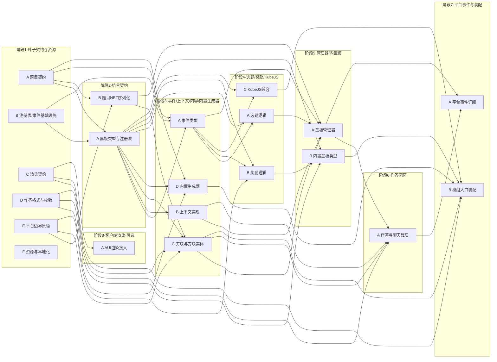

# Blackboard 平行任务分解（多 Agent 协作）

> 本文件基于主大纲 [master-outline.md](./master-outline.md)，把全部实现工作拆分为**互相独立的平行任务**与**有序阶段**。
> - **阶段（Phase）之间有依赖**：后一阶段依赖前一阶段的产出。
> - **同一阶段内的任务互相独立**：负责文件互不重叠、互不依赖，可由不同 Agent **同时**开工。
> - 每个文件/类的详细职责见主大纲 §1–§13；签名以 [internal-core-api](../references/internal-core-api.md)、[answer-format-and-validation](../references/answer-format-and-validation.md) 为权威。
> - 现状：**M0 工程骨架已完成并通过两节点构建**（见主大纲 §14）。本文件覆盖 M1–M6 的全部代码与资源。

标记沿用主大纲：🟦 纯 Kotlin · 🟨 含平台边界（Stonecutter `//? if forge`/`//? if neoforge`）· 🟥 待反编译确认或待决策。

---

## 1. 使用方式

1. 一次只激活**一个阶段**。该阶段内的每个任务分配给一个 Agent，独占其「负责文件」。
2. Agent 只能新建/修改自己「负责文件」清单中的文件；**严禁改动他人文件**。需要改动公共契约时，先回到对应契约任务协调。
3. 阶段内所有任务完成并合并后，过**阶段门禁**（见 §2）方可进入下一阶段。
4. 每个任务开工前先读「参考」列指向的文档段落，按其权威签名编码，避免下游返工。

---

## 2. 并行协作约定与阶段门禁

- **文件独占**：以「负责文件」为唯一可写范围；同阶段任务零文件交集（已逐任务核对）。
- **契约冻结**：阶段 1、2 产出的 `api/*` 类型签名一经合并即冻结；下游严格按 [internal-core-api](../references/internal-core-api.md) 的签名实现，不得擅改。确需变更→提回契约任务统一改。
- **平台边界**：🟨 文件用 Stonecutter 注释隔离两版差异；改完 active 版本后，对应节点要能 build。详见 [stonecutter](../references/stonecutter.md)、[loader-platform-api](../references/loader-platform-api.md)。
- **🟥 反编译确认**：C4（服务端聊天事件）、C5（战利品发奖）、C6（`Component` 编解码）在落地时对照**反编译源码**（导入后可在 Loom 生成的 `-sources` jar 或 `genSources` 产物中查阅 1.20.1 / 1.21.1 实际签名）。
- **单元测试**：纯逻辑（注册表/事件/选题/校验/NBT 往返）在 `src/test/kotlin` 写 JUnit；只测不依赖 MC 运行时的部分。
- **阶段门禁（进入下一阶段的硬性条件）**：
  1. 本阶段全部任务合并；
  2. `./gradlew :1.20.1-forge:build` 与 `./gradlew :1.21.1-neoforge:build` 均 `BUILD SUCCESSFUL`（守护进程 Java 21，见仓库记忆/主大纲 §14）；
  3. 本阶段涉及的单测全部通过。

> **API 契约簇例外（重要）**：`api/question/*`、`api/board/*` 与 `api/chat/{AnswerFormat,ParsedAnswer}` 互相**循环引用**（如 `GenerationContext.blackboard: BlackboardType`），无法分文件单独编译；这一簇契约必须**一起编译**才能 build 绿——已由 **P1-A** 一次性交付（见 §7）。其余 P1/P2 任务仍可在其基础上并行。
> **测试基建**：`build.gradle.kts` 已接入 JUnit5（`junit-jupiter` + `junit-platform-launcher`）与 `tasks.test { useJUnitPlatform() }`；纯逻辑单测放 `src/test/kotlin`。

---

## 3. 阶段依赖总览

> 阶段最短关键链（决定阶段数）：题目→黑板→事件→选题→管理器→作答→平台事件/装配（7 阶段）；客户端渲染为可选第 8 阶段。

---

## 进度看板

> 图例：✅ 已完成（已过阶段门禁）· 🚧 进行中 · ⬜ 未开始。各 Agent 完成任务并过验收后，更新本表与 §4 对应任务行。

| 阶段 | 任务 | 状态 | 负责 | 备注 |
| --- | --- | --- | --- | --- |
| 1 | P1-A 题目契约 | ✅ | Agent1 | 题目契约全交付；并随契约簇交付 P2-A 的 `api/board/*` 与 P1-D 的 `api/chat/{AnswerFormat,ParsedAnswer}`；两节点 build 绿、单测通过 |
| 1 | P1-B 注册表/事件基础设施 | ✅ | Agent2 | `SimpleRegistry`+`EventHook`；6+4 个单测在两节点全部通过 |
| 1 | P1-C 渲染契约 | ✅ | Agent3 | `api/render` 三件套；纯 Kotlin、无平台分支（MC 类型两版同包）；两节点 build 绿 |
| 1 | P1-D 作答格式与校验 | ✅ | Agent1 | `DefaultAnswerFormat`+`Validators`（`api/chat` 接口随 P1-A 簇先行交付）；2+3 个单测两节点通过 |
| 1 | P1-E 平台边界原语 | ✅ | Agent3 | `api/BlackboardApi`+`platform/{PlatformRegistration,PlatformComponents,PlatformLoot}`+`content/SyncedBlockEntity`；Stonecutter 隔离两版；🟥C5/C6 经编译确认；两节点 build 绿 |
| 1 | P1-F 资源与本地化 | ✅ | Agent2 | blockstate+方块/物品模型+中英 lang+占位贴图+默认奖励表；loot 表双路径 `loot_tables`(1.20.1)/`loot_table`(1.21.1)；两节点 build 绿 |
| 2 | P2-A 黑板类型与注册表 | ✅ | Agent1 | `BlackboardRegistries`（双注册表+`freezeAll`）、便捷 `register`、`GeneratorPool.resolve`；`api/board/*` 早随 P1-A 簇交付；3 个单测两节点通过 |
| 2 | P2-B 题目 NBT 序列化 | ✅ | Agent2 | `toNbt`/`toClientNbt`/`questionFromNbt`；往返单测 1.20.1 全通过、1.21.1 跳过序列化用例（需 bootstrap）；两节点 build 绿 |
| 3 | P3-A 事件类型 | ✅ | Agent1 | 五个事件类型 + `BlackboardEvents` 聚合 `EventHook`；`BlackboardEventsTest`(3) 两节点通过 |
| 3 | P3-B 上下文实现 | ✅ | Agent2 | `GenerationContextImpl`/`AnswerContextImpl`/`SelectionContextImpl`（internal data class）；两节点编译通过 |
| 3 | P3-C 方块与方块实体 | ✅ | Agent3 | `content/{BlackboardBlock,BlackboardBlockEntity,ModBlocks,ModItems,ModBlockEntities}`；FACING 方块+BE（单题持久化、客户端免答案同步、`onSolved` 奖励+销毁）；Stonecutter 隔离两版；两节点 build 绿 |
| 3 | P3-D 内置生成器 | ✅ | Agent1 | 加/减/乘/除/平方（MATH）+ 是非题（TEXT），复用 Validators；`BuiltinGeneratorsTest`(3) 两节点通过 |
| 4 | P4-A 选题逻辑 | ✅ | Agent1 | `selectGenerator`（resolve→事件→forced→selector）+ `weightedRandomSelect`；`SelectionTest`(4) 两节点通过 |
| 4 | P4-B 奖励逻辑 | ✅ | Agent2 | `defaultReward`：初值=类型 lootTable→广播 REWARD（可置 null 取消/追加 extraDrops）→roll 一次+发放；平台调 PlatformLoot，无 Stonecutter 分支。两节点 build 绿（KubeJS 的 JitPack 传递依赖 `animated-gif-lib` 已在 build.gradle.kts 中 `exclude`，见 [multiloader-build §7](../references/multiloader-build.md)） |
| 4 | P4-C KubeJS 兼容 | ✅ | Agent3 | 插件+`EventGroup`+三事件（注册/选题/奖励）；KJS6(forge)/KJS7(neoforge) 软依赖 `modCompileOnly`；按真实 jar 反查 API，Stonecutter 仅隔离基类/插件签名；排除 `animated-gif-lib` 传递依赖（可移植，同时解除 P4-B 的 neoforge 阻塞）；两节点 build 绿 |
| 5 | P5-A 黑板管理器 | ✅ | Agent2 | object 管理器：每维度 boardId→BlockPos 索引（track/untrack/findBoard）、generateQuestion（选题→出题→广播 QUESTION_GENERATED→setQuestion 标脏同步）、freezeRegistries、clearLevel/clearAll；纯 Kotlin 无分支；两节点 build 绿 |
| 5 | P5-B 内置黑板类型 | ✅ | Agent3 | `DEFAULT_TYPE`（`blackboard:default`）：`ByTag(DEFAULT)`/`weightedRandomSelect`/`onSolved=defaultReward`/`rewards/default`/`DefaultAnswerFormat`/不限次；`ALL`+`register()`；两节点 build 绿。⚠ DEFAULT 标签暂无生成器（P3-D 仅 MATH/TEXT），需补标签 |
| 6 | P6-A 作答与聊天处理 | ✅ | Agent1 | `AnswerHandler`（定位→validate→三态→广播 ANSWER）+ `ChatHandler`（解析路由，§13(2) 不拦截）；实为纯 Kotlin（C4 聊天事件订阅属 P7-A）；两节点 build 绿 |
| 7 | P7-A 平台事件订阅 | ✅ | Agent1 | `@EventBusSubscriber`：`ServerChatEvent`→ChatHandler、ServerAboutToStart→freezeRegistries、ServerStopping→clearAll、ChunkEvent.Load/Unload→track/untrack；C4 编译确认；两节点 build 绿 |
| 7 | P7-B 模组入口装配 | ✅ | Agent2 | 在 Agent1 的 DeferredRegister 接线上扩展：`BuiltinGenerators`→`Types.register()`、KubeJS 守卫（`ModList.isLoaded("kubejs")`）接 `BlackboardKubePlugin.register(bus)`；渲染器留 P8-A、冻结留 P7-A；两节点 build 绿 |
| 8 | P8-A AUI 渲染接入（可选） | ⬜ | — | |

---

## 4. 阶段任务清单

> 路径简写：`…/` = `src/main/kotlin/com/tonywww/blackboard/`；资源 = `src/main/resources/`。
> 「依赖」列只列**前置阶段**的任务；同阶段任务之间无依赖。

### 阶段 1 — 叶子契约与独立资源（全部无前置依赖，可同时开工）

| 任务 | 负责文件（独占） | 参考 | 验收/产出 |
| --- | --- | --- | --- |
| **P1-A 题目契约** 🟦 ✅ **已完成** | `…/api/question/{Question,Questions,QuestionGenerator,GenerationContext,AnswerContext,AnswerResult}.kt` + `…/core/QuestionImpl.kt` | 主大纲 §3；[internal-core-api §4.1](../references/internal-core-api.md) | ✅ 两节点 build 绿、单测通过（`QuestionBuilderTest`）；`Questions.builder(id)` 产出 `QuestionImpl`；`AnswerResult` 三态齐全。详见 §7 进度跟踪。 |
| **P1-B 注册表/事件基础设施** ✅ 🟦 | `…/api/registry/SimpleRegistry.kt` + `…/api/event/EventHook.kt` | [internal-core-api §2/§3](../references/internal-core-api.md) | `SimpleRegistry` 保序/标签索引/freeze；`EventHook` 逐监听器 try/catch。单测：注册重复报错、`byTag`、`invoke` 容错。**✅ 已完成（Agent2）**。 |
| **P1-C 渲染契约** ✅ 🟦 | `…/api/render/{BlackboardRenderer,RenderContext,BlackboardRendering}.kt` | 主大纲 §3；设计 §5.2 | `BlackboardRendering.renderer` 默认 No-op，可替换。**✅ 已完成（Agent3）**。 |
| **P1-D 作答格式与校验** 🟦 ✅ **已完成** | `…/chat/DefaultAnswerFormat.kt` + `…/validation/Validators.kt`（`…/api/chat/{AnswerFormat,ParsedAnswer}.kt` 已随 P1-A 簇交付） | [answer-format-and-validation](../references/answer-format-and-validation.md) §1/§2/§5–§9 | ✅ 两节点 build 绿、单测通过（`DefaultAnswerFormatTest` 2、`ValidatorsTest` 3）。`!ans <boardId> <答案>` 解析含边界用例；`Validators` 文字/数值/矩阵/表达式（接口先行）。 |
| **P1-E 平台边界原语** ✅ 🟨🟥 | `…/api/BlackboardApi.kt` + `…/platform/{PlatformRegistration,PlatformComponents,PlatformLoot}.kt` + `…/content/SyncedBlockEntity.kt` | [loader-platform-api](../references/loader-platform-api.md) §1/§2/§6 | `id()`/标签；`DeferredRegister` 封装；`Component`↔`String`（🟥C6）；战利品 roll/给物（🟥C5）；BE 同步基类（1.20/1.21 `getUpdateTag` 🟨）。**✅ 已完成（Agent3）；C5/C6 已编译确认**。 |
| **P1-F 资源与本地化** 🟦 ✅ | `…/assets/blackboard/**`（blockstates/models/textures/lang `en_us`,`zh_cn`）+ `…/data/blackboard/{loot_tables,loot_table}/rewards/default.json` | 主大纲 §11；设计 §11 | 方块 id 固定 `blackboard`；默认奖励表可被数据包覆盖；贴图/模型/语言占位齐全。**✅ 已完成（Agent2）**：1.21 数据包目录改名，故 loot 表同时提供 `loot_tables`(1.20.1) 与 `loot_table`(1.21.1) 双路径。 |

> 隔离说明：六个任务零文件交集。P1-E 由「平台专员」统一处理所有版本边界与 🟥 项；其它任务保持纯 Kotlin，不写 `//? if`。

### 阶段 2 — 组合契约（依赖阶段 1）

| 任务 | 负责文件（独占） | 依赖 | 参考 | 验收/产出 |
| --- | --- | --- | --- | --- |
| **P2-A 黑板类型与注册表** 🟦 ✅ **已完成** | `…/api/registry/BlackboardRegistries.kt`（双注册表 + `freezeAll()` + 便捷 `register` + `GeneratorPool.resolve(reg)`）；`api/board/*` 已随 P1-A 簇交付 | P1-A、P1-B | 主大纲 §3；[internal-core-api §2/§4.3](../references/internal-core-api.md) | ✅ 两节点 build 绿、单测通过（`BlackboardRegistriesTest` 3：按标签/显式/全部解析、跳过未知 id、`freezeAll`）。`BlackboardType.Builder` 已实现（**无** `regenerateOnSolved`，见 §13(3)）。 |
| **P2-B 题目 NBT 序列化** 🟨 ✅ | `…/core/QuestionNbt.kt` | P1-A、P1-E | [internal-core-api §9](../references/internal-core-api.md) | `toNbt`/`fromNbt` 键 `Generator/Content/Prompt/Data`；客户端同步只下发 `Generator+Content`。单测：往返一致（纯逻辑部分）。**✅ 已完成（Agent2）**：平台差异全封装于 `PlatformComponents`，本文件无 Stonecutter 分支；另提供 `toClientNbt`（防作弊）与 null 安全的 `questionFromNbt`。 |

### 阶段 3 — 事件 / 上下文 / 内容 / 内置生成器（依赖阶段 1–2）

| 任务 | 负责文件（独占） | 依赖 | 参考 | 验收/产出 |
| --- | --- | --- | --- | --- |
| **P3-A 事件类型** 🟦 ✅ **已完成** | `…/api/event/{BlackboardEvents,SelectGeneratorEvent,QuestionGeneratedEvent,AnswerEvent,RewardEvent}.kt` | P1-A、P1-B、P2-A | 设计 §6；[internal-core-api §6/§7](../references/internal-core-api.md) | ✅ 两节点 build 绿、单测通过（`BlackboardEventsTest` 3）。四事件对象 + `BlackboardEvents` 聚合 `EventHook`；`WeightedGenerator`/`SelectionContext` 复用 `api.board`。 |
| **P3-B 上下文实现** 🟦 ✅ | `…/core/Contexts.kt` | P1-A、P2-A | [internal-core-api §5](../references/internal-core-api.md) | `GenerationContextImpl`/`AnswerContextImpl`/`SelectionContextImpl`。**✅ 已完成（Agent2）**：三个 internal data class，字段与接口逐一匹配，纯 Kotlin 无平台分支；两节点 .class 均产出。 |
| **P3-C 方块与方块实体** ✅ 🟨 | `…/content/{BlackboardBlockEntity,BlackboardBlock,ModBlocks,ModBlockEntities,ModItems}.kt` | P1-C、P1-E、P2-A、P2-B | [loader-platform-api §1/§2/§3](../references/loader-platform-api.md)；设计 §3/§11 | 放置→分配 `boardId`；BE 持有单题、`saveAdditional/load`（1.21 带 registries 🟨）；`open fun onSolved` 默认=`type.onSolved`+`destroyBlock`（§13(3)）；`ModBlocks/BE/Items` 暴露 `register(bus)`。**✅ 已完成（Agent3）**。 |
| **P3-D 内置生成器** 🟦 ✅ **已完成** | `…/builtin/BuiltinGenerators.kt`（依赖 `BlackboardApi.id`/`BlackboardTags`，已由 P1-E 提供） | P1-A、P1-D、P2-A、(P1-E：BlackboardApi) | 主大纲 §7；设计 §5.4 | ✅ 两节点 build 绿、单测通过（`BuiltinGeneratorsTest` 3）。加/减/乘/除/平方（MATH，`Validators.number`）+ 是非题（TEXT，`Validators.text`）；`ALL` + `register()`。 |

> 隔离说明：`api/event/*`、`core/Contexts.kt`、`content/*`、`builtin/BuiltinGenerators.kt` 四组零交集。P3-C 不直接依赖事件（出题/判题由阶段 5/6 的管理器与作答驱动）。

### 阶段 4 — 选题 / 奖励 / KubeJS（依赖阶段 1–3）

| 任务 | 负责文件（独占） | 依赖 | 参考 | 验收/产出 |
| --- | --- | --- | --- | --- |
| **P4-A 选题逻辑** 🟦 ✅ **已完成** | `…/core/Selection.kt` | P2-A、P3-A、P1-B | [internal-core-api §6](../references/internal-core-api.md) | ✅ 两节点 build 绿、单测通过（`SelectionTest` 4：加权随机分布/全非正回退、`forced` 优先、`selector` 选择）。`selectGenerator(type,ctx,registry?)`→`resolve`→广播 `SELECT_GENERATOR`→`forced` 优先→`selector`；`weightedRandomSelect` 用 `ctx.level.random`（纯逻辑抽到 `pickWeighted(., RandomSource)` 便于单测）。 |
| **P4-B 奖励逻辑** 🟨 ✅ | `…/core/Reward.kt` | P2-A、P3-A、P1-E | [internal-core-api §7](../references/internal-core-api.md) | `defaultReward(rc)`：roll 战利品→广播 `REWARD`→发放（满则掉落）；平台部分调 `PlatformLoot`。**✅ 已完成（Agent2）**：采用「`lootTable` 作为是否再 roll 的开关」简化规则——初值=类型 `rewardLootTable`，监听器可置 null 取消或追加 `extraDrops`，事件后 roll 一次并连同 `extraDrops` 发放；平台差异封装于 `PlatformLoot`，本文件无分支。forge 节点编译通过；neoforge 节点构建当前被**无关的** KubeJS(neoforge) 传递依赖 `animated-gif-lib-for-java`（需 jitpack 仓库）阻塞，非本任务代码问题。 |
| **P4-C KubeJS 兼容** ✅ 🟨 | `…/compat/kubejs/**`（`BlackboardKubePlugin`,`BlackboardKubeEvents`,`events/*`）+ `resources/kubejs.plugins.txt` | P1-A、P2-A、P3-A | [kubejs-integration](../references/kubejs-integration.md) §1/§5/§6 | `EventGroup` + 三事件（注册/选题/奖励）；`kubejs.plugins.txt` 写插件 FQN。**软依赖**：缺 KubeJS 不应导致加载失败。**✅ 已完成（Agent3）**。 |

### 阶段 5 — 管理器 / 内置黑板（依赖阶段 1–4）

| 任务 | 负责文件（独占） | 依赖 | 参考 | 验收/产出 |
| --- | --- | --- | --- | --- |
| **P5-A 黑板管理器** 🟦 ✅ | `…/core/BlackboardManager.kt` | P4-A、P2-B、P3-A、P3-C | [internal-core-api §10](../references/internal-core-api.md)；[answer-format §3](../references/answer-format-and-validation.md) | `boardId→BlockPos` 索引（随区块加载/卸载）；触发出题（`selectGenerator`+`generate`+广播 `QUESTION_GENERATED`+持久化+标脏同步）；冻结时机协调。§13(5) 每板单题。**✅ 已完成（Agent2）**：`object` 管理器，提供 `track/untrack/findBoard`（每维度索引，findBoard 带过期/不匹配校验）、`generateQuestion(be,player?)`（选题→出题→广播→`setQuestion` 写入并同步，第三方生成器异常被捕获）、`freezeRegistries`、`clearLevel/clearAll`；纯 Kotlin 无 Stonecutter 分支，两节点 .class 均产出。出题触发与索引登记的实际接线由 P7-A 调用本类完成。 |
| **P5-B 内置黑板类型** ✅ 🟦 | `…/builtin/BuiltinBlackboardTypes.kt` | P2-A、P1-D、P4-B | [internal-core-api §4.3](../references/internal-core-api.md) | 注册 `DEFAULT_TYPE`（`ByTag(DEFAULT)`/`weightedRandomSelect`/`onSolved=defaultReward`/`DefaultAnswerFormat`/`rewards/default`），暴露 `register()`。**✅ 已完成（Agent3）**；⚠ `ByTag(DEFAULT)` 暂无候选，需 P3-D 给生成器补 `#blackboard:default` 标签（或调整选题池）。 |

### 阶段 6 — 作答闭环（依赖阶段 1–5）

| 任务 | 负责文件（独占） | 依赖 | 参考 | 验收/产出 |
| --- | --- | --- | --- | --- |
| **P6-A 作答与聊天处理** � ✅ **已完成** | `…/core/AnswerHandler.kt` + `…/chat/ChatHandler.kt` | P5-A、P3-B、P3-C、P1-D | [answer-format §10](../references/answer-format-and-validation.md)；设计 §7.2 | ✅ 两节点 build 绿、class 均产出。`handleAnswer`：`BlackboardManager.findBoard`→组 `AnswerContextImpl`→生成器 `validate`→三态（`Correct`→`be.onSolved` 奖励+销毁 §13(3)；`Incorrect`→`incrementAttempts`，达 `maxAttempts` 提示；`Invalid`→不计次回送提示）→广播 `ANSWER`。`ChatHandler.handle(player,msg)` 用 `format`（默认 `DefaultAnswerFormat`）解析并路由，命中返回 true（§13(2) 不拦截）。**实为纯 🟦**——C4 聊天事件订阅在 P7-A，本二文件无 Stonecutter 分支。因依赖 `ServerPlayer`/BE 不可单测构造，以编译为验证（同 P5-A）。 |

> 该阶段仅一个任务：作答主流程与聊天路由强耦合（`ChatHandler`→`AnswerHandler`），由单个 Agent 顺序完成，无法再拆为同阶段并行。

### 阶段 7 — 平台事件订阅与模组装配（依赖阶段 1–6）

| 任务 | 负责文件（独占） | 依赖 | 参考 | 验收/产出 |
| --- | --- | --- | --- | --- |
| **P7-A 平台事件订阅** 🟨🟥 ✅ **已完成** | `…/platform/PlatformEvents.kt` | P6-A、P5-A | [kotlinlangforge §3](../references/kotlinlangforge.md)；[loader-platform-api §6](../references/loader-platform-api.md)；[internal-core-api §10](../references/internal-core-api.md) | ✅ 两节点 build 绿、class 均产出。KLF `@EventBusSubscriber`（自动判总线）：`ServerChatEvent`→`ChatHandler.handle(player,rawText)`（§13(2) 不拦截）；`ServerAboutToStartEvent`→`freezeRegistries()`；`ServerStoppingEvent`→`clearAll()`；`ChunkEvent.Load/Unload`→`track/untrack`。**C4 经编译确认**（`getPlayer`/`getRawText` 两版同名，仅 import 分平台）；KLF 运行期自动注册待 `runClient` 实测。 |
| **P7-B 模组入口装配** 🟨 ✅ | `…/Blackboard.kt` | P3-C、P3-D、P5-B、P4-C、P1-C | [kotlinlangforge §2/§7](../references/kotlinlangforge.md)；[internal-core-api §10](../references/internal-core-api.md) | 取 mod 总线→`ModBlocks/BE/Items.register(bus)`→`BuiltinGenerators/Types.register()`→注册默认渲染器（客户端）→`BlackboardKubePlugin.register(bus)`（若有 KubeJS）。**✅ 已完成（Agent2）**：在 Agent1 已接的 DeferredRegister（含 `ModCreativeTabs`）基础上扩展——`BuiltinGenerators.register()` 后 `BuiltinBlackboardTypes.register()`（§10 公共初始化期、冻结前）；KubeJS 用 `ModList.get().isLoaded("kubejs")` 守卫后调 `BlackboardKubePlugin.register(bus)`（软依赖，缺 KubeJS 不触类）。渲染器留 No-op 默认由 P8-A 客户端注入、冻结由 P7-A；`ModList` import 用 Stonecutter 分平台。两节点 build 绿、class 均产出。 |

> 隔离说明：P7-A 只管**生命周期/聊天总线**与冻结时机；P7-B 只管 **mod 总线注册**与内容/渲染装配。两者文件不同、职责不交叉、互不调用，可并行。冻结统一由 P7-A 负责（P7-B 不碰冻结）。

### 阶段 8 — 客户端渲染接入（可选，依赖阶段 1 渲染契约 + ApricityUI）

| 任务 | 负责文件（独占） | 依赖 | 参考 | 验收/产出 |
| --- | --- | --- | --- | --- |
| **P8-A AUI 渲染接入** 🟥 | `…/client/BlackboardClient.kt` + `ApricityBlackboardRenderer`（命名待定） | P1-C；ApricityUI | 设计 §8；主大纲 §10 | 实现 `BlackboardRenderer` 并注入 `BlackboardRendering.renderer`；接 ApricityUI（依赖坐标/世界渲染 API 待补）。当前可先占位。 |

---

## 5. 阶段 ↔ 里程碑映射（与主大纲 §14 对齐）

| 主大纲里程碑 | 对应平行任务 |
| --- | --- |
| M1 核心 API（纯 Kotlin） | P1-A/B/C/D、P2-A/B、P3-A/B/D、P4-A、P4-B（去平台部分） |
| M2 方块与同步 | P1-E、P2-B、P3-C、P5-A |
| M3 作答闭环 | P4-B（平台部分）、P1-F（默认战利品表）、P6-A、P7-A |
| M4 内置内容 | P3-D、P5-B |
| M5 KubeJS 兼容 | P4-C |
| M6 AUI 渲染接入 | P8-A |

---

## 6. 🟥 待反编译 / 待决策清单（落地时确认）

| 标记 | 位置 | 处理 |
| --- | --- | --- |
| ✅ C4 服务端聊天事件（P7-A 编译确认） | P7-A `PlatformEvents` / P6-A `ChatHandler` | 两版 `ServerChatEvent`（forge `net.minecraftforge.event` / neoforge `net.neoforged.neoforge.event`）的 `getPlayer():ServerPlayer`、`getRawText():String` 同名；仅 import 经 Stonecutter 隔离，方法体共享。§13(2) 当前不拦截（未 `setCanceled`）。两节点编译通过；KLF 运行期注册待实测。 |
| ✅ C5 战利品发奖（P1-E 已确认） | P1-E `PlatformLoot` / P4-B `Reward` | 1.20.1 `server.lootData.getLootTable(id)`；1.21.1 `server.reloadableRegistries().getLootTable(ResourceKey.create(Registries.LOOT_TABLE, id))`；共用 `LootParams.Builder`+`getRandomItems`。两节点编译通过。 |
| ✅ C6 `Component` 编解码（P1-E 已确认） | P1-E `PlatformComponents` | 两版均用 `Component.Serializer`：1.20.1 `toJson/fromJson(component)`；1.21.1 `toJson/fromJson(component, HolderLookup.Provider)`。两节点编译通过。 |
| §13(1) 作答格式/boardId 形态 | P1-D / P5-A | 暂定 `!ans <boardId> <答案>`，boardId 策略待拍板。 |
| §13(2) 是否拦截聊天 | P6-A / P7-A | 暂不拦截（先放行）。 |
| §13(4) 难度来源 | P3-C / P1-A | 暂定 `difficulty=0`。 |

> §13(3) 答对销毁、§13(5) 每板单题已拍板，分别落在 P3-C/P6-A 与 P3-C/P5-A。

---

## 7. 契约簇说明（Agent1 实现 P1-A 时的发现与处置）

> 实时任务状态以顶部 **进度看板** 为唯一来源；本节仅记录「API 契约簇」的结构性说明，避免双表分叉。

**关于「契约簇」**

P1-A 的 `GenerationContext.blackboard` 字段类型为 `BlackboardType`，而 `BlackboardType` 又引用 `GeneratorPool`/`SelectionContext`/`RewardContext`/`WeightedGenerator`/`AnswerFormat`/`QuestionGenerator`——这些类型构成一个**强连通的循环依赖簇**，无法按原计划分到不同阶段单独编译。为使仓库保持「build 绿、可验证、单测可跑」，Agent1 在完成 P1-A 的同时，一并交付了该簇**最小必要**的耦合契约：

- `api/board/*` 五个契约类（属 P2-A，已交付；P2-A 仅剩 `BlackboardRegistries` 与 `GeneratorPool.resolve(reg)`，二者依赖 P1-B 的 `SimpleRegistry`）。
- `api/chat/{AnswerFormat,ParsedAnswer}` 两个接口（属 P1-D，已交付；P1-D 仅剩 `DefaultAnswerFormat`+`Validators`）。

**对后续 Agent 的影响**：开工 P2-A / P1-D 前，先确认上述文件已存在，不要重复创建；只补各自「剩余」部分。其余阶段不受影响。

**建议计划修正**：后续可考虑将 P1-A + P2-A（板契约）+ P1-D（聊天接口）合并为单一「API 契约簇」任务，以准确反映「必须一起编译」的事实。

**已交付文件清单（P1-A 簇）**：`api/question/{Question,Questions,QuestionGenerator,GenerationContext,AnswerContext,AnswerResult}.kt`、`core/QuestionImpl.kt`、`api/board/{BlackboardType,GeneratorPool,SelectionContext,RewardContext,WeightedGenerator}.kt`、`api/chat/{AnswerFormat,ParsedAnswer}.kt`、`src/test/kotlin/.../QuestionBuilderTest.kt`；并在 `build.gradle.kts` 接入 JUnit5 测试基建。

---

## 修订记录
- 2026-06-30：基于主大纲建立平行任务分解；7 个有序阶段 + 可选客户端阶段，共 21 个任务；同阶段任务零文件交集，逐任务标注依赖、参考、验收与隔离边界。
- 2026-06-30：Agent2 完成 **P1-B 注册表/事件基础设施**：新增 `api/registry/SimpleRegistry.kt`、`api/event/EventHook.kt` 及对应单测（`SimpleRegistryTest` 6 例、`EventHookTest` 4 例）；`:1.20.1-forge:build` 与 `:1.21.1-neoforge:build` 均绿，单测两节点全部通过。
- 2026-07-01：Agent2 完成 **P1-F 资源与本地化**：新增 blockstate、方块/物品模型、中英 lang、两张 16x16 占位贴图与默认奖励战利品表；因 1.21 数据包目录重命名，loot 表同时放于 `loot_tables`(1.20.1) 与 `loot_table`(1.21.1)；JSON 均校验通过，资源已打包进两节点 jar，build 均绿。
- 2026-07-01：Agent2 完成 **P2-B 题目 NBT 序列化**：新增 `core/QuestionNbt.kt`（`Question.toNbt` 全量、`toClientNbt` 仅 Generator+Content、`questionFromNbt` null 安全）与 `QuestionNbtTest`（6 例）；用 `ResourceLocation.tryParse` 跨版本解析 id，组件编解码平台差异封装于 `PlatformComponents`（本文件无分支）。两节点 build 绿；往返测试 1.20.1 全通过，1.21.1 因组件编解码需 bootstrap 而跳过 4 例（校验类用例两节点均通过）。
- 2026-07-01：Agent2 完成 **P3-B 上下文实现**：新增 `core/Contexts.kt`（`GenerationContextImpl`/`AnswerContextImpl`/`SelectionContextImpl` 三个 internal data class，逐字段匹配接口）；纯 Kotlin 无 Stonecutter 分支，两节点 .class 均产出、build 绿。因依赖 `ServerLevel`/`ServerPlayer` 等不可在单测构造，按验收不写单测，以编译为验证。
- 2026-06-30：Agent1 完成 P1-A（题目契约）。因 `api/question`↔`api/board`↔`api/chat` 契约循环引用，随簇一并交付 P2-A 的 `api/board/*` 与 P1-D 的 `api/chat/{AnswerFormat,ParsedAnswer}`；接入 JUnit5；两节点 build 绿、单测通过。更新各任务状态与「契约簇」说明。
- 2026-06-30：Agent1 完成 P1-D（`DefaultAnswerFormat` + `Validators`，含文字/数值/矩阵/表达式校验与解析工具）；新增 `DefaultAnswerFormatTest`(2)、`ValidatorsTest`(3)，两节点单测全过。
- 2026-07-01：Agent1 完成 P2-A 剩余部分：`BlackboardRegistries`（双注册表 + `freezeAll()`）、便捷 `register` 扩展、`GeneratorPool.resolve(reg)`（放 `api/registry` 侧以保持 `api.registry → api.board` 单向依赖）；新增 `BlackboardRegistriesTest`(3)，两节点 build 绿、单测全过。P2-A 全部完成。
- 2026-07-01：Agent1 完成 P3-A（事件类型）：`SelectGeneratorEvent`/`QuestionGeneratedEvent`/`AnswerEvent`/`RewardEvent` + `BlackboardEvents` 聚合四个 `EventHook`（复用 `api.board` 的 `WeightedGenerator`/`SelectionContext`）；新增 `BlackboardEventsTest`(3)，两节点 build 绿、单测全过。
- 2026-07-01：Agent1 完成 P3-D（内置生成器）：6 个生成器（加/减/乘/除/平方 + 是非题），判题复用 P1-D `Validators`，提供 `ALL` + `register()`；新增 `BuiltinGeneratorsTest`(3)。依赖 `BlackboardApi`（`id`/`BlackboardTags`，由 P1-E 并发提供）；两节点 build 绿、单测全过。
- 2026-07-01：Agent1 完成 P4-A（选题逻辑）：`core/Selection.kt` 的 `selectGenerator`（resolve→广播 `SELECT_GENERATOR`→`forced` 优先→`selector`）与 `weightedRandomSelect`（纯逻辑抽为 `pickWeighted` 便于单测；`selectGenerator` 加可选 `registry` 形参供注入）；新增 `SelectionTest`(4)。期间遇并发 P4-C 的 `kubejs-neoforge` 依赖瞬时解析超时，重试后恢复；两节点 build 绿、`SelectionTest` 两节点 4/4。
- 2026-07-01：Agent1（补充任务）添加**创造模式物品栏**：新增 `content/ModCreativeTabs.kt`（用 vanilla `Registries.CREATIVE_MODE_TAB`，两版仅 `DeferredRegister` 导入分平台；标题用既有 lang 键 `itemGroup.blackboard`；标签页含黑板方块物品）。并在入口 `Blackboard.kt` 用 KLF `MOD_BUS` 接通 `ModBlocks/ModItems/ModBlockEntities/ModCreativeTabs` 的 `register(bus)`（此前入口仍是 M0 桩、不注册任何内容）。**⚠️ P7-B 请在此基础上扩展**（`BuiltinGenerators/Types.register()`、客户端渲染器、KubeJS、注册表冻结时机），勿重复 DeferredRegister 接线。两节点 build 绿。
- 2026-07-01：Agent1 完成 **P6-A（作答与聊天处理）**：新增 `core/AnswerHandler.kt`（`handleAnswer`：`BlackboardManager.findBoard`→`AnswerContextImpl`→生成器 `validate`→三态 `Correct`(`onSolved` 奖励+销毁)/`Incorrect`(`incrementAttempts`+上限提示)/`Invalid`(不计次)→广播 `BlackboardEvents.ANSWER`）与 `chat/ChatHandler.kt`（`format`（默认 `DefaultAnswerFormat`）解析→路由 `AnswerHandler`，命中返回 true，§13(2) 不拦截）。二者**实为纯 🟦 无 Stonecutter 分支**——C4 聊天事件订阅在 P7-A；本二文件只接收已抽好的 (player, message)。因依赖 `ServerPlayer`/BE 不可单测构造，按 P5-A 先例以两节点编译+class 产出为验证。两节点 build 绿。
- 2026-07-01：Agent1 完成 **P7-A（平台事件订阅）**：新增 `platform/PlatformEvents.kt`（KLF `@EventBusSubscriber` 对象，KLF 按事件类型自动判总线）：`ServerChatEvent`→`ChatHandler.handle(player, rawText)`（C4，§13(2) 不拦截）、`ServerAboutToStartEvent`→`BlackboardManager.freezeRegistries()`、`ServerStoppingEvent`→`clearAll()`、`ChunkEvent.Load/Unload`→`track/untrack`（遍历 `LevelChunk.blockEntities`，P5-A 委托的索引接线）。加载器差异仅在 import（Stonecutter 隔离），方法体共享。**C4 经两节点编译确认**（`getPlayer`/`getRawText` 两版同名）；因依赖 MC 运行时不可单测，以编译+class 产出为验证；KLF 自动注册的运行期行为待 `runClient` 实测。两节点 build 绿。
- 2026-06-30：Agent3 完成 P1-C（渲染契约）。新增 `api/render/{RenderContext,BlackboardRenderer,BlackboardRendering}.kt`（纯 Kotlin；`Level`/`BlockPos`/`BlockState`/`Component` 在 1.20.1 与 1.21.1 同包，无需 Stonecutter 分支）；`BlackboardRendering.renderer` 默认 No-op；与 Agent1 契约簇共存，两节点 build 绿。
- 2026-06-30：Agent3 完成 P1-E（平台边界原语）。新增 `api/BlackboardApi.kt`、`platform/{PlatformRegistration,PlatformComponents,PlatformLoot}.kt`、`content/SyncedBlockEntity.kt`，用 Stonecutter `//? if forge/neoforge` 隔离两版差异（`ResourceLocation` 构造、`DeferredRegister` 句柄、`Component.Serializer` 形参、战利品表查找、`getUpdateTag`）。**经编译确认 C5/C6 两版签名**：C6 两版均可用 `Component.Serializer`（1.21.1 带 `HolderLookup.Provider` 形参）；C5 1.21.1 用 `reloadableRegistries().getLootTable(ResourceKey)`。两节点 build 绿。
- 2026-07-01：Agent3 完成 **P3-C（方块与方块实体）**：新增 `content/{BlackboardBlock,BlackboardBlockEntity,ModBlocks,ModItems,ModBlockEntities}.kt`。`BlackboardBlock` 为带 `FACING` 的 `BaseEntityBlock`（与 P1-F blockstate 对齐；1.21.1 额外实现 `codec()`）；`BlackboardBlockEntity`（`open`，可被其它模组重写）持有单题、全量 `saveAdditional/load`（1.21 带 `HolderLookup.Provider`，1.20.1 用 `level.registryAccess()`/`RegistryAccess.EMPTY`），`getUpdateTag` 仅下发 `toClientNbt`（不含答案 `Data`），`onSolved` 默认发奖+`destroyBlock`（§13(3)），放置时分配 `boardId`（§13(1) 占位）；`ModBlocks/Items/BlockEntities` 暴露 `register(bus)`（用显式 `Supplier<T>` 消除 NeoForge `register` 重载歧义）。两节点 build 绿。
- 2026-07-01：Agent2 完成 **P4-B 奖励逻辑**：新增 `core/Reward.kt` 的 `defaultReward(rc)`——以 `BlackboardType.rewardLootTable` 为 `RewardEvent.lootTable` 初值，广播 `BlackboardEvents.REWARD`（监听器可置 null 取消默认发放或向 `extraDrops` 追加），事件后若 `lootTable!=null` 则 `PlatformLoot.rollLootTable` 一次并连同 `extraDrops` 经 `giveOrDrop` 发放（internal-core-api §7「lootTable 作开关」简化规则）；平台差异全在 `PlatformLoot`，本文件无 Stonecutter 分支。`:1.20.1-forge:compileKotlin` 通过（无分支故等价于两节点）；`:1.21.1-neoforge` 构建被**无关**的 KubeJS(neoforge) 传递依赖 `com.github.rtyley:animated-gif-lib-for-java`（缺 jitpack 仓库）阻塞——非 P4-B 代码问题，待 KubeJS(P4-C) 配置在 repositories 增加 `https://jitpack.io` 后解除。
- 2026-07-01：Agent3 完成 **P4-C（KubeJS 兼容）**：新增 `compat/kubejs/{BlackboardKubePlugin,BlackboardKubeEvents,RegisterGeneratorsKubeEvent,SelectGeneratorKubeEvent,RewardKubeEvent}.kt` 与 `resources/kubejs.plugins.txt`。`EventGroup("BlackboardEvents")` + 三事件：startup `registerGenerators`（注册 `QuestionGenerator`）、server `selectGenerator`/`reward`（包装原生 `BlackboardEvents` 并写回）。**软依赖**：`build.gradle.kts` 增 `modCompileOnly` KubeJS+Rhino（按 loader：`kubejs-forge 2001.6.5-build.26`/KJS6、`kubejs-neoforge 2101.7.2-build.369`/KJS7），节点 `gradle.properties` 增 `deps.kubejs`/`deps.rhino`。KubeJS 传递拉取仅存于 JitPack 的 `com.github.rtyley:animated-gif-lib-for-java`（中国网络不稳），compat 代码不用它——故在两 loader 的 KubeJS `modCompileOnly` 上 `exclude` 该传递依赖（可移植、**无需 JitPack 仓库**），**同时解除 Agent2 在 P4-B 标记的 neoforge `animated-gif-lib` 阻塞**；曾短暂加过 JitPack 仓库，确认 `exclude` 足够后已移除。用 `javap` 反查真实 jar 确认 API：KJS6 `KubeJSPlugin`（类，`registerEvents()`）/`StartupEventJS`/`ServerEventJS`；KJS7 `plugin.KubeJSPlugin`（接口，`registerEvents(EventGroupRegistry)`）/`KubeStartupEvent`/`ServerKubeEvent`——Stonecutter 仅隔离基类与插件 `registerEvents` 签名+2 个 import，逻辑共享。P7-B 调 `register(bus)` 需以 KubeJS 是否加载为前置守卫。两节点 build 绿，5 个 compat class 与 `kubejs.plugins.txt` 均入两节点 jar。
- 2026-07-01：Agent2 完成 **P5-A 黑板管理器**：新增 `core/BlackboardManager.kt`（`object`）——每维度 `boardId→BlockPos` 索引（`track`/`untrack`/`findBoard`，findBoard 带过期/不匹配校验）；`generateQuestion(be,player?)` 串起 `selectGenerator`→`generator.generate`→广播 `BlackboardEvents.QUESTION_GENERATED`→`be.setQuestion`（标脏+同步），并捕获第三方生成器异常；`freezeRegistries()` 协调 `BlackboardRegistries.freezeAll`；`clearLevel/clearAll` 维护生命周期。难度暂用 0（§13(4)）。纯 Kotlin 无 Stonecutter 分支（仅用两版同包 MC 类型）；两节点 build 绿、`BlackboardManager.class` 均产出。因依赖 `ServerLevel`/BE 等不可单测构造，按验收以编译为验证；实际事件接线（区块加载/卸载→track/untrack、放置→generateQuestion、服务器启动→freeze）由 P7-A 调用。
- 2026-07-01：Agent3 完成 **P5-B（内置黑板类型）**：新增 `builtin/BuiltinBlackboardTypes.kt`，按 internal-core-api §4.3 注册 `DEFAULT_TYPE`（id `blackboard:default`）：`pool=ByTag(DEFAULT)`、`selector=::weightedRandomSelect`（§6）、`onSolved=::defaultReward`（§7）、`rewardLootTable=rewards/default`、`answerFormat=DefaultAnswerFormat`、`maxAttempts=0`（不限次）；暴露 `ALL` + `register()`（注入 `BLACKBOARD_TYPES`，须冻结前调、且在 `BuiltinGenerators.register()` 之后）。纯 Kotlin 无 Stonecutter 分支，两节点 build 绿、class 均产出。**跨任务协调项**：`ByTag(DEFAULT)` 当前无候选——内置生成器（P3-D）仅带 `MATH`/`TEXT` 标签，需给生成器补 `#blackboard:default` 标签（或将 `DEFAULT_TYPE` 池改为 `All`/显式集合）后该类型方能选到题；本次未改他人文件。
- 2026-07-01：Agent2 完成 **P7-B 模组入口装配**：在入口 `Blackboard.kt`（Agent1 已接 `ModBlocks/Items/BlockEntities/CreativeTabs.register(MOD_BUS)`）基础上扩展——构造期依次 `BuiltinGenerators.register()`→`BuiltinBlackboardTypes.register()`（internal-core-api §10 公共初始化、P7-A 冻结前）；KubeJS 软依赖用 `ModList.get().isLoaded("kubejs")` 守卫后调 `BlackboardKubePlugin.register(bus)`（缺 KubeJS 不加载其类；dev 下 KubeJS 为 modCompileOnly 故守卫为 false、不触发）。默认渲染器保持 No-op（由 P8-A 客户端注入）、注册表冻结归 P7-A，二者本任务不碰。`ModList` import 用 Stonecutter `//? if forge/neoforge` 分平台（已确认 neoforge 节点切换为 `net.neoforged.fml.ModList`）。两节点 build 绿、`Blackboard.class` 均产出；依赖运行时（总线/ModList）不可单测，以编译+Stonecutter 切换验证。
